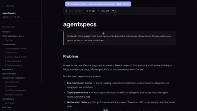

# agentspecs

Your agent writes specs. agentspecs makes them real.



## The problem

The first thing you do with Claude Code is spec out what you're building. PRDs, architecture docs, API designs, RFCs. But you're reading raw markdown in a chat window. No diagrams, no navigation, no structure. You copy-paste to Notion just to *see* it. You go 5 rounds refining and there's no diff, no versioning. You retype feedback in chat and hope Claude knows which section you mean.

The spec phase is the highest-leverage moment in a project — and we're doing it in plaintext chat bubbles.

## What agentspecs does

agentspecs is a Claude Code Desktop plugin. When your agent writes a spec, it renders as a beautiful, interactive document in your browser — live. You review it, leave Figma-style comments, and Claude reads your feedback and replies in-thread. The spec becomes a real artifact that lives in your repo.

```
You: "Write a PRD for the auth system"

Claude: [calls create_spec → spec renders live in browser]

You: [presses C → clicks "Token Refresh" → types "Add refresh token rotation?"]

Claude: [reads feedback → replies in-thread → updates the spec]

→ Browser updates live. Version bumps. Diff shows exactly what changed.
```

## Quick start

```bash
npm install @json437/agentspecs
npx agentspecs init
```

That's it. Next time you start Claude Code, it auto-discovers agentspecs. Ask your agent to write a spec and it renders at `localhost`.

## Features

- **Live preview** — Markdown renders with syntax highlighting, Mermaid diagrams, and table of contents. Updates via WebSocket as Claude writes.
- **Figma-style comments** — Press `C`, click anywhere, leave feedback. Claude reads it with `get_feedback` and replies in-thread with `reply_to_feedback`.
- **Version history** — Every update creates a version with git context (branch, commit, dirty state). Visual diffs between any two versions. Revert to any previous version.
- **Status lifecycle** — Draft → In Review → Approved → Implementing → Done. Transitions are enforced.
- **8 templates** — PRD, API, Architecture, RFC, Bug Report, Migration, Runbook, Design Doc. Full scaffolding with diagrams and tables.
- **Dashboard** — Search, filter by status, sort by date/version. See all your specs at a glance.
- **Git-friendly** — Everything lives in `.agentspecs/` as markdown and JSON. Commit it, diff it, review it in PRs.
- **Zero config** — `init` wires up `.mcp.json`, `launch.json`, and `CLAUDE.md` automatically.

## MCP tools

Your agent gets these tools automatically:

| Tool | What it does |
|------|-------------|
| `create_spec` | Create a spec (optionally from a template). Returns a live URL. |
| `update_spec` | Replace content. New version, live reload. |
| `update_section` | Update one section by heading name. |
| `get_feedback` | Read inline comments with full reply threads. |
| `reply_to_feedback` | Reply to a comment in-thread. |
| `resolve_feedback` | Mark feedback as addressed. |
| `set_status` | Move spec through its lifecycle. |
| `link_commit` | Link an implementation commit to a spec. |
| `revert_to_version` | Roll back to previous content. |
| `delete_spec` | Remove a spec permanently. |
| `list_specs` | List all specs with status. |

## CLI

```bash
npx agentspecs serve          # start the web UI
npx agentspecs list           # list all specs
npx agentspecs open my-spec   # open in browser
```

## Storage

```
.agentspecs/
  specs/
    auth-system/
      spec.md            # current content
      meta.json          # title, status, version, git context
      feedback.json      # comments and replies
      versions/
        v1.md
        v2.md
```

Designed to be committed. Specs show up in diffs, PRs, and blame.

## Configuration

`.agentspecs/config.json`:
```json
{ "port": 0 }
```

Port `0` means random available port (default). Set a specific port if you prefer. Or use env vars: `AGENTSPECS_PORT`, `AGENTSPECS_PROJECT_DIR`.

## License

MIT
